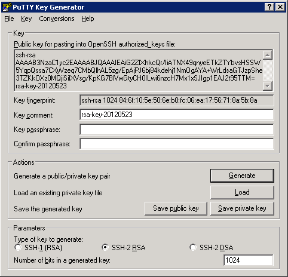
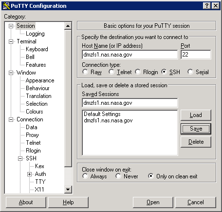
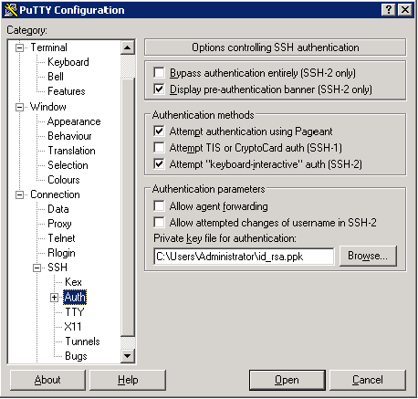
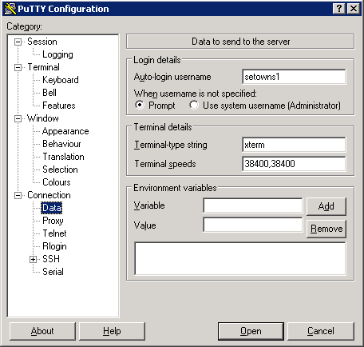

.. _`tutorial`:

========
Tutorial
========

As you can see from this diagram of data flow, both the client and server
sides of the NAS access scheme need to communicate with a NAS DMZ file server.

.. figure:: dataflow.png
   :align: center

   Remote NAS Access Dataflow 

This tutorial will step you through the configuration and testing of the NAS
access scheme.

.. note::

    Various references to the host ``dmzfs1.nasa.nasa.gov`` are made below.
    An equivalent is ``dmzfs2.nas.nasa.gov``. Either may be used as long as
    you are consistent.

.. note::

    The examples below specify version 0.2.6 of OpenMDAO. That is just the
    latest version when this was written. You may replace this with whatever
    version of OpenMDAO you need to use.

.. index:: pleiades installation

*Pleiades installation*
_______________________

Installing OpenMDAO on Pleiades is essentially the same as installing 
on any other Linux host, with a couple of minor wrinkles. First, SciPy is not
installed. This typically isn't a problem if you're using Pleiades to run
some large parallel code rather than an OpenMDAO optimization. Second, the
default user shell is ``csh`` rather than ``bash``.  If you prefer ``bash``
as your login shell, use the ``chsh`` command::

    chsh /bin/bash

We'll stick with ``csh`` in this tutorial.  It requires only a slight change
to how you activate your OpenMDAO environment.

So, start by downloading and installing OpenMDAO::

    wget http://openmdao.org/releases/0.2.6/go-openmdao.py
    python go-openmdao.py --noprereqs

Note the ``--noprereqs`` option; this avoids issues with SciPy not being
installed.

Now, activate but using a ``csh`` environment::

    cd openmdao-0.2.6
    source bin/activate.csh

Next, install the ``nas_access`` plugin::

    plugin install nas_access --github

While the PBS allocator is part of the stock OpenMDAO installation, it is not
automatically made part of the available resources. In addition, at least at
NAS it needs to be configured with an accounting ID. We can configure an
allocator named `PBS` with a ``~/.openmdao/resources.cfg`` file entry such
as this::

    [PBS]
    classname: openmdao.main.pbs.PBS_Allocator
    accounting_id: no-default-set

where ``no-default-set`` is replaced by your group account ID. You can
determine your group account ID via the NAS command::

    acct_ytd

To test that the PBS allocator is configured correctly, we'll run a
`simulation` that outputs the process environment (code placed in
``pbs_test.py``)::

    import logging

    from openmdao.main.api import enable_console, Assembly
    from openmdao.lib.components.api import ExternalCode

    class Simulation(Assembly):

        def __init__(self):
            super(Simulation, self).__init__()
            extcode = self.add('extcode', ExternalCode())
            extcode.command = ['printenv']
            self.driver.workflow.add('extcode')

    def main():
        # Enable logging to the screen.
        enable_console()
        logging.getLogger().setLevel(logging.DEBUG)

        # Create and run our simulation using PBS.
        sim = Simulation()
        sim.extcode.resources = dict(allocator='PBS', queue_name='debug')
        sim.run()

    if __name__ == '__main__':
        main()

The run may take a while, but once it completes, the output should contain
``PBS_O_QUEUE``, showing that it was run under the PBS queuing system::

    python pbs_test.py
    I LocalHost: PID: 73072, 'PublicKey', allow_shell True
    D RAM: Configuring from '/u/setowns1/.openmdao/resources.cfg'
    D RAM:   name: PBS
    D RAM:     classname: openmdao.main.pbs.PBS_Allocator
    I PBS: PID: 73072, 'AuthKey', allow_shell True
    D PBS:     accounting_id: g24161
    D RAM: 'LocalHost' incompatible: key 'allocator': wrong allocator
    D RAM: 'PBS' OK
    D RAM: deploying on 'PBS'
    I PBS: create typname '', version None server None, res_desc None, args {'allowed_users': {'setowns1@pfe1': <_RSAobj @0x165c320 n(2048),e>}, 'name': 'Sim-1'}
    D PBS: setowns1@pfe1 starting server 'Sim-1' in dir Sim-1
    D root: Server process 73083 startup in 0.00
    I PBS: new server 'Sim-1' for setowns1@pfe1
    I PBS:     in dir Sim-1
    I PBS:     listening on /tmp/pymp-NgDSUe/listener-oq491v
    D PBS: create returning <pbs_pbs_PBS_Server object, typeid 'pbs_pbs_PBS_Server' at 0x1658410> at '/tmp/pymp-NgDSUe/listener-oq491v'
    I RAM: allocated 'Sim-1' pid 73083 on pfe1
    D extcode: No input files
    I extcode: executing ['printenv']...
    I extcode: elapsed time: 488.5 sec.
    I extcode: retrieving results...
    D extcode: unpacking 'printenv.stdout' (1814)...
    D extcode: unpacking 'error.out' (0)...
    MODULE_VERSION_STACK=3.1.6
    MANPATH=:::/opt/c3/man:/opt/sgi/share/man:/opt/sgi/share/man
    HOSTNAME=r55i0n10
    TERM=xterm
    SHELL=/bin/sh
    HOST=pfe1
    SSH_CLIENT=129.99.242.1 4524 22
    PBS_JOBNAME=extcode
    TMPDIR=/tmp/pbs.188691.pbspl1.nas.nasa.gov
    PBS_ENVIRONMENT=PBS_BATCH
    PBS_O_TZ=PST8PDT
    OLDPWD=/u/setowns1
    PBS_O_WORKDIR=/home1/setowns1/Sim-1
    SSH_TTY=/dev/pts/55
    NCPUS=8
    GROUP=a0811
    USER=setowns1
    PBS_TASKNUM=1
    PBS_O_HOME=/u/setowns1
    ENV=/usr/local/lib/global.kshrc
    OSCAR_HOME=/opt/oscar
    HOSTTYPE=x86_64-linux
    FORT_BUFFERED=1
    PBS_MOMPORT=15003
    VIRTUAL_ENV=/home1/setowns1/OpenMDAO-Framework/devenv
    CSHEDIT=emacs
    PBS_O_QUEUE=debug
    PATH=/home1/setowns1/OpenMDAO-Framework/devenv/bin:/usr/local/bin:/usr/bin:/bin:/usr/X11R6/bin:/PBS/bin:/usr/sbin:/sbin:/opt/c3/bin:/opt/sgi/sbin:/opt/sgi/bin:/opt/sgi/sbin:/opt/sgi/bin:/u/setowns1/bin
    MODULE_VERSION=3.1.6
    PBS_O_LOGNAME=setowns1
    MAIL=/var/mail/setowns1
    PBS_O_LANG=C
    PBS_JOBCOOKIE=00000000207DB83E000000005275737E
    PWD=/u/setowns1/Sim-1
    LANG=C
    PBS_NODENUM=0
    MODULEPATH=/usr/share/modules/modulefiles:/nasa/modulefiles-sles11
    PYTHONSTARTUP=/etc/pythonstart
    TZ=PST8PDT
    LOADEDMODULES=
    PBS_JOBDIR=/u/setowns1
    C3_RSH=ssh -oConnectTimeout=10 -oForwardX11=no
    PBS_O_SHELL=/bin/csh
    PBS_JOBID=188691.pbspl1.nas.nasa.gov
    ENVIRONMENT=BATCH
    HOME=/u/setowns1
    SHLVL=3
    OSTYPE=linux
    PBS_O_HOST=pfe1.nas.nasa.gov
    VENDOR=suse
    MACHTYPE=x86_64
    LOGNAME=setowns1
    CVS_RSH=ssh
    SSH_CONNECTION=129.99.242.1 4524 129.99.240.31 22
    PBS_QUEUE=debug
    MODULESHOME=/usr/share/modules
    PBS_O_MAIL=/var/mail/setowns1
    OMP_NUM_THREADS=1
    DISPLAY=pfe1:49.0
    PBS_O_SYSTEM=Linux
    PBS_NODEFILE=/var/spool/pbs/aux/188691.pbspl1.nas.nasa.gov
    PBS_O_PATH=/home1/setowns1/OpenMDAO-Framework/devenv/bin:/usr/local/bin:/usr/bin:/bin:/usr/X11R6/bin:/PBS/bin:/usr/sbin:/sbin:/opt/c3/bin:/opt/sgi/sbin:/opt/sgi/bin
    _=/usr/bin/printenv
    I RAM: release 'Sim-1' pid 73083 on pfe1
    D PBS: release <pbs_pbs_PBS_Server object, typeid 'pbs_pbs_PBS_Server' at 0x1658410>
    D PBS:         at '/tmp/pymp-NgDSUe/listener-oq491v'
    D root: sending shutdown message to manager

Now, to provide remote access to Pleiades, we need to set up communications
between the front-end and DMZ hosts. If you don't already have an ``ssh``
key generated for Pleiades, do that now. (Just hit the ``Enter`` key when asked
for a file or passphrase)::

    ssh-keygen

You should now have a ``~/.ssh/id_rsa.pub`` file. We need to copy that to the
DMZ host we'll be using. To help keep track of multiple keys on the remote
host, copy it to a different name related to the host it was generated on
(in this example ``pfe1``)::

    scp ~/.ssh/id_rsa.pub dmzfs1:.ssh/id_rsa.pfe1

To add it to the remote ``authorized_keys`` file, log in and append it to
any existing authorized keys::

    ssh dmzfs1
    cat .ssh/pfe1.pub >>.ssh/authorized_keys
    echo "" >>.ssh/authorized_keys
    exit

To test that communications are set up correctly, run a simple test::

    ssh dmzfs1 date

This should simply print the date (after the U.S. Government computer access
warning). If you are still prompted to enter a password, something is wrong
with your configuration.

Now we're ready to run the RJE server::

    python -m nas_access.rje --allocator PBS &

The trailing ``&`` above causes the server process to be put in the background, or
detached from the terminal shell process. You can check that the server is
running by looking at the log file::

    cat openmdao_log.txt
    I LocalHost: PID: 98317, 'PublicKey', allow_shell True
    D RAM: Configuring from '/u/setowns1/.openmdao/resources.cfg'
    D RAM:   name: PBS
    D RAM:     classname: openmdao.main.pbs.PBS_Allocator
    I PBS: PID: 98317, 'AuthKey', allow_shell True
    D PBS:     accounting_id: g24161
    I root: RJE server ready

With the server running in the background, we can safely log out.  It should
remain running until the host is rebooted, which is infrequent.

While typically you'll want to run PBS jobs, at times it's useful to run
on the front-end host without any queueing delays.  You can do this by
running the RJE server with the ``LocalHost`` allocator::

    python -m nas_access.rje --allocator LocalHost &

.. note::

    You can only run one RJE server per host. To support multiple RJE
    servers, run them on separate hosts.

.. index:: linux/mac client installation

*Linux/Mac OS X client installation*
____________________________________

Start by downloading and installing OpenMDAO::

    wget http://openmdao.org/releases/0.2.6/go-openmdao.py
    python go-openmdao.py

Activate the OpenMDAO environment::

    cd openmdao-0.2.6
    . bin/activate

Next, install the ``nas_access`` plugin::

    plugin install nas_access --github

We'll need to be able to ``scp`` and ``ssh`` to one of the NAS DMZ file servers
(``dmzfs1.nas.nasa.gov`` or ``dmzfs2.nas.nasa.gov``) without requiring any
user intervention. If you don't already have an ``ssh`` key generated for the
local machine, do that now. (Just hit the ``Enter`` key when asked for a file or
passphrase)::

    ssh-keygen

You should now have a ``~/.ssh/id_rsa.pub`` file. We need to copy that to the
DMZ host we'll be using.  To help keep track of multiple keys on the remote
host, copy it to a different name related to the host it was generated on
(in this example ``torpedo``)::

    scp ~/.ssh/id_rsa.pub dmzfs1.nas.nasa.gov:.ssh/id_rsa.torpedo

To add it to the remote ``authorized_keys`` file, log in and append it to
any existing authorized keys::

    ssh dmzfs1.nas.nasa.gov
    cat .ssh/id_rsa.torpedo >>.ssh/authorized_keys
    echo "" >>.ssh/authorized_keys
    exit

To test that communications are set up correctly, run a simple test::

    ssh dmzfs1.nas.nasa.gov date

This should simply print the date in the remote timezone (after the U.S.
Government computer access warning). If you are still prompted to enter a
password, something is wrong with your configuration.

.. note::

    If your username on the client machine does not match your NAS username,
    add a 'username@' prefix to the DMZ hostname in the above commands,
    replacing 'username' with your NAS username.

.. index:: windows client installation

*Windows client installation*
_____________________________

Start by downloading and installing OpenMDAO. There are multiple ways of doing
this. What's shown here is an alternative to that described in the online
OpenMDAO documentation that works in at least some environments::

    start http://openmdao.org/releases/0.2.6/go-openmdao.py
    python Downloads/go-openmdao.py

Activate the OpenMDAO environment::

    cd openmdao-0.2.6
    Scripts\activate

Next, install the ``nas_access`` plugin::

    plugin install nas_access --github

Go back to your original directory so files created next won't be clobbered
if you update your OpenMDAO configuration::

    cd ..

The ``plink`` and ``pscp`` commands from the ``PuTTY`` package are used to
communicate with the NAS DMZ file servers, so we need to install that if it's
not already on your machine.  The link here is from the PuTTY download page::

    start http://the.earth.li/~sgtatham/putty/latest/x86/putty-0.62-installer.exe

If you used the defaults during the installation process, then the line below
will update ``PATH`` appropriately. (For the current session only; you'll need
to make this permanent based on which version of Windows you're running.)::

    set PATH=%PATH%;C:\Program Files\PuTTY

Assuming you don't already have PuTTY public and private keys saved, run
the ``puttygen`` tool::

    puttygen

Click the ``Generate`` button and wait for the keys to be generated while
moving the mouse around.  You should have a window that looks like this:

   PuTTY Key Generation

Click the ``Save private key`` button and enter a file name, for example,
``id_rsa``.  Click in the ``Public key for pasting into OpenSSH`` window;
then right-click and choose ``Select All``.  Then choose ``Copy``.
Close puttygen and start up Notepad::

    notepad

Right-click in the Notepad window and choose ``Paste``.  Now save the Notepad
file to ``id_rsa.pub``.

.. note::

    If you `lose` the copied public key, just restart `puttygen` and use the
    ``Load`` button to reload ``id_rsa``.

You should now have ``id_rsa.pub`` and ``id_rsa.ppk`` files.

Next we'll create a PuTTY session named ``dmzfs1.nas.nasa.gov`` via the
PuTTY tool::

    putty

   PuTTY Session

The session name should match the host name (one of the DMZ hosts).
Be sure to enter the ``id_rsa.ppk`` file name under the ``Connection/SSH/Auth``
section:

   PuTTY Authentication

If your local username is different than your NAS username, enter your NAS
username in the ``Connection/Data`` section:

   PuTTY Username

Use the ``Save`` button (shown in the opening screen) to save the session.

With a public/private key pair generated and a session referencing them
created, we now need to copy the public key file to the DMZ host we'll be
using.  To help keep track of multiple keys on the remote host, copy it to a
different name related to the host it was generated on (in this example,
``pc``)::

    pscp id_rsa.pub dmzfs1.nas.nasa.gov:.ssh/id_rsa.pc

To add it to the remote ``authorized_keys`` file, log in and append it to
any existing authorized keys::

    plink dmzfs1.nas.nasa.gov
    cat .ssh/id_rsa.pc >>.ssh/authorized_keys
    echo "" >>.ssh/authorized_keys
    exit

To test that communications are set up correctly, run a simple test::

    plink dmzfs1.nas.nasa.gov date

This should simply print the date (in the remote timezone). If you are still
prompted to enter a password, something is wrong with your configuration.

.. warning::

    The ``id_rsa.ppk`` file should be protected from access by other users.
    It contains your private key which must remain private!  Use the
    ``Security`` tab on the ``Properties`` panel to ensure this file is not
    accessible by other users.

.. index:: testing

*Testing*
_________

The ``NAS_Allocator`` requires some configuration information, which can either
be set in your OpenMDAO code or in a configuration file.  We'll put it in the
OpenMDAO code for this tutorial.  The :ref:`usage` has an example configuration
file.

To test that your NAS access configuration is functional, we'll run a trivial
`simulation` that outputs the process environment (code placed in
``nas_test.py``)::

    import logging

    from nas_access import NAS_Allocator

    from openmdao.main.api import enable_console, Assembly
    from openmdao.main.resource import ResourceAllocationManager as RAM
    from openmdao.lib.components.api import ExternalCode

    class Simulation(Assembly):

        def __init__(self):
            super(Simulation, self).__init__()
            extcode = self.add('extcode', ExternalCode())
            extcode.command = ['printenv']
            self.driver.workflow.add('extcode')

    def main():
        # Enable logging to the screen.
        enable_console()
        logging.getLogger().setLevel(logging.DEBUG)

        # Configure access to Pleiades.
        RAM.add_allocator(NAS_Allocator(name='Pleiades',
                                        dmz_host='dmzfs1.nas.nasa.gov',
                                        server_host='pfe1'))

        # Create and run our simulation on Pleiades.
        sim = Simulation()
        sim.extcode.resources = dict(allocator='Pleiades', queue_name='debug')
        sim.run()

    if __name__ == '__main__':
        main()

Note that the above defines a single ``NAS_Allocator``.  You can define as
many allocators as  there are RJE servers running. You can have only one RJE
server running on a front-end host, but Pleiades has multiple front-end hosts,
so simply alter the ``server_host`` argument to suit.  For instance, two
allocators could provide access to remote LocalHost as well as PBS servers.

.. note::

    If your username on the client machine does not match your NAS username,
    you must add ``username='NAS-username'`` to the `NAS_Allocator` arguments.

Running the test should get output similar to this::

    python nas_test.py
    D Pleiades: init
    D Pleiades: connecting to RJE-pfe1 at dmzfs1.nas.nasa.gov
    I Pleiades: initializing
    D Pleiades: connected to 'pfe1' on 'dmzfs1.nas.nasa.gov'
    I LocalHost: PID: 1493, 'PublicKey', allow_shell True
    D RAM: 'LocalHost' incompatible: key 'allocator': wrong allocator
    D Pleiades: request 1: 'time_estimate' ({'queue_name': 'debug'},) {}
    D Pleiades: reply 1: (0, {'total_cpus': 10000})
    D RAM: 'Pleiades' OK
    D RAM: deploying on 'Pleiades'
    D Pleiades: request 2: 'deploy' ('Sim-1', {'queue_name': 'debug', 'allocator': 'Pleiades'}, {'total_cpus': 10000}) {}
    D Pleiades: reply 2: ('RJE-pfe1/ip-10-243-75-178-1493-Pleiades/Sim-1', 64515)
    D Pleiades/Sim-1: connecting to RJE-pfe1 at dmzfs1.nas.nasa.gov
    I Pleiades/Sim-1: initializing
    I RAM: allocated 'Sim-1' pid 64515 on pfe1
    D extcode: No input files
    I extcode: executing ['printenv']...
    D Pleiades/Sim-1: request 1: 'execute_command' ({'queue_name': 'debug', 'output_path': 'printenv.stdout', 'allocator': 'Pleiades', 'remote_command': 'printenv', 'job_name': 'extcode', 'error_path': 'error.out'},) {}
    D Pleiades/Sim-1: reply 1: (0, '')
    I extcode: elapsed time: 390.0 sec.
    I extcode: retrieving results...
    D Pleiades/Sim-1: request 2: 'pack_zipfile' (['printenv.stdout', 'error.out'], 'outputs.zip') {}
    D Pleiades/Sim-1: reply 2: (2, 1875)
    D Pleiades/Sim-1: open 'outputs.zip' 'rb' -1
    D Pleiades/Sim-1: request 3: 'putfile' ('outputs.zip', True) {}
    D Pleiades/Sim-1: reply 3: None
    D Pleiades/Sim-1: request 4: 'stat' ('outputs.zip',) {}
    D Pleiades/Sim-1: reply 4: [33152, 4107055211L, 25L, 1, 2866, 20811, 2097, 1338304865, 1338304865, 1338304865]
    D extcode: unpacking 'printenv.stdout' (1875)...
    D extcode: unpacking 'error.out' (0)...
    D Pleiades/Sim-1: request 5: 'remove' ('outputs.zip',) {}
    D Pleiades/Sim-1: reply 5: None
    MODULE_VERSION_STACK=3.1.6
    MANPATH=:::/opt/c3/man:/opt/sgi/share/man:/opt/sgi/share/man
    HOSTNAME=r62i0n1
    TERM=xterm
    SHELL=/bin/sh
    HOST=pfe1
    SSH_CLIENT=129.99.242.1 4524 22
    PBS_JOBNAME=extcode
    TMPDIR=/tmp/pbs.188804.pbspl1.nas.nasa.gov
    PBS_ENVIRONMENT=PBS_BATCH
    PBS_O_TZ=PST8PDT
    OLDPWD=/u/setowns1
    PBS_O_WORKDIR=/home1/setowns1/ip-10-243-75-178-1493-Pleiades-Sim-1
    SSH_TTY=/dev/pts/55
    NCPUS=8
    GROUP=a0811
    USER=setowns1
    PBS_TASKNUM=1
    PBS_O_HOME=/u/setowns1
    ENV=/usr/local/lib/global.kshrc
    OSCAR_HOME=/opt/oscar
    HOSTTYPE=x86_64-linux
    FORT_BUFFERED=1
    PBS_MOMPORT=15003
    VIRTUAL_ENV=/home1/setowns1/OpenMDAO-Framework/devenv
    CSHEDIT=emacs
    PBS_O_QUEUE=debug
    PATH=/home1/setowns1/OpenMDAO-Framework/devenv/bin:/usr/local/bin:/usr/bin:/bin:/usr/X11R6/bin:/PBS/bin:/usr/sbin:/sbin:/opt/c3/bin:/opt/sgi/sbin:/opt/sgi/bin:/opt/sgi/sbin:/opt/sgi/bin:/u/setowns1/bin
    MODULE_VERSION=3.1.6
    PBS_O_LOGNAME=setowns1
    MAIL=/var/mail/setowns1
    PBS_O_LANG=C
    PBS_JOBCOOKIE=000000007E6DD92A0000000062C750CD
    PWD=/u/setowns1/ip-10-243-75-178-1493-Pleiades-Sim-1
    LANG=C
    PBS_NODENUM=0
    MODULEPATH=/usr/share/modules/modulefiles:/nasa/modulefiles-sles11
    PYTHONSTARTUP=/etc/pythonstart
    TZ=PST8PDT
    LOADEDMODULES=
    PBS_JOBDIR=/u/setowns1
    C3_RSH=ssh -oConnectTimeout=10 -oForwardX11=no
    PBS_O_SHELL=/bin/csh
    PBS_JOBID=188804.pbspl1.nas.nasa.gov
    ENVIRONMENT=BATCH
    HOME=/u/setowns1
    SHLVL=3
    OSTYPE=linux
    PBS_O_HOST=pfe1.nas.nasa.gov
    VENDOR=suse
    MACHTYPE=x86_64
    LOGNAME=setowns1
    CVS_RSH=ssh
    SSH_CONNECTION=129.99.242.1 4524 129.99.240.31 22
    PBS_QUEUE=debug
    MODULESHOME=/usr/share/modules
    PBS_O_MAIL=/var/mail/setowns1
    OMP_NUM_THREADS=1
    DISPLAY=pfe1:49.0
    PBS_O_SYSTEM=Linux
    PBS_NODEFILE=/var/spool/pbs/aux/188804.pbspl1.nas.nasa.gov
    PBS_O_PATH=/home1/setowns1/OpenMDAO-Framework/devenv/bin:/usr/local/bin:/usr/bin:/bin:/usr/X11R6/bin:/PBS/bin:/usr/sbin:/sbin:/opt/c3/bin:/opt/sgi/sbin:/opt/sgi/bin
    _=/usr/bin/printenv
    I RAM: release 'Sim-1' pid 64515 on pfe1
    D Pleiades: request 3: 'release' ('RJE-pfe1/ip-10-243-75-178-1493-Pleiades/Sim-1',) {}
    D Pleiades: reply 3: None
    D Pleiades/Sim-1: shutdown
    D Pleiades/Sim-1: close
    D Pleiades: request 4: 'shutdown' () {}
    D Pleiades: reply 4: None
    D Pleiades: close

Corrseponding server output should look similar to this::

    I root: New client 'ip-10-243-75-178-1493-Pleiades'
    I ip-10-243-75-178-1493-Pleiades: initializing
    D ip-10-243-75-178-1493-Pleiades: request: 'time_estimate' ({'queue_name': 'debug'},) {}
    D ip-10-243-75-178-1493-Pleiades: reply 1: (0, {'total_cpus': 10000})
    D ip-10-243-75-178-1493-Pleiades: request: 'deploy' ('Sim-1', {'queue_name': 'debug', 'allocator': 'Pleiades'}, {'total_cpus': 10000}) {}
    I PBS: create typname '', version None server None, res_desc None, args {'allowed_users': {'setowns1@pfe1': <_RSAobj @0x1586758 n(2048),e>}, 'name': 'ip-10-243-75-178-1493-Pleiades-Sim-1'}
    D PBS: setowns1@pfe1 starting server 'ip-10-243-75-178-1493-Pleiades-Sim-1' in dir ip-10-243-75-178-1493-Pleiades-Sim-1
    D root: Server process 64515 startup in 0.01
    I PBS: new server 'ip-10-243-75-178-1493-Pleiades-Sim-1' for setowns1@pfe1
    I PBS:     in dir ip-10-243-75-178-1493-Pleiades-Sim-1
    I PBS:     listening on /tmp/pymp-Lna9G4/listener-ZWGHlM
    D PBS: create returning <pbs_pbs_PBS_Server object, typeid 'pbs_pbs_PBS_Server' at 0x1582cd0> at '/tmp/pymp-Lna9G4/listener-ZWGHlM'
    I ip-10-243-75-178-1493-Pleiades-Sim-1: initializing
    D ip-10-243-75-178-1493-Pleiades: reply 2: ('RJE-pfe1/ip-10-243-75-178-1493-Pleiades/Sim-1', 64515)
    D ip-10-243-75-178-1493-Pleiades-Sim-1: request: 'execute_command' ({'queue_name': 'debug', 'output_path': 'printenv.stdout', 'allocator': 'Pleiades', 'remote_command': 'printenv', 'job_name': 'extcode', 'error_path': 'error.out'},) {}
    D ip-10-243-75-178-1493-Pleiades-Sim-1: reply 1: (0, '')
    D ip-10-243-75-178-1493-Pleiades-Sim-1: request: 'pack_zipfile' (['printenv.stdout', 'error.out'], 'outputs.zip') {}
    D ip-10-243-75-178-1493-Pleiades-Sim-1: reply 2: (2, 1875)
    D ip-10-243-75-178-1493-Pleiades-Sim-1: request: 'putfile' ('outputs.zip', True) {}
    D ip-10-243-75-178-1493-Pleiades-Sim-1: reply 3: None
    D ip-10-243-75-178-1493-Pleiades-Sim-1: request: 'stat' ('outputs.zip',) {}
    D ip-10-243-75-178-1493-Pleiades-Sim-1: reply 4: [33152, 4107055211, 25L, 1, 2866, 20811, 2097, 1338304865, 1338304865, 1338304865]
    D ip-10-243-75-178-1493-Pleiades-Sim-1: request: 'remove' ('outputs.zip',) {}
    D ip-10-243-75-178-1493-Pleiades-Sim-1: reply 5: None
    D ip-10-243-75-178-1493-Pleiades: request: 'release' ('RJE-pfe1/ip-10-243-75-178-1493-Pleiades/Sim-1',) {}
    D PBS: release <pbs_pbs_PBS_Server object, typeid 'pbs_pbs_PBS_Server' at 0x1582cd0>
    D PBS:         at '/tmp/pymp-Lna9G4/listener-ZWGHlM'
    D root: sending shutdown message to manager
    D ip-10-243-75-178-1493-Pleiades: reply 3: None
    D ip-10-243-75-178-1493-Pleiades: request: 'shutdown' () {}
    D ip-10-243-75-178-1493-Pleiades: reply 4: None
    I root: Client 'ip-10-243-75-178-1493-Pleiades' closed

